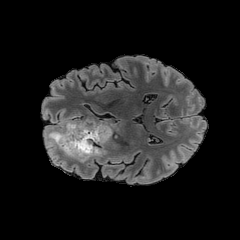
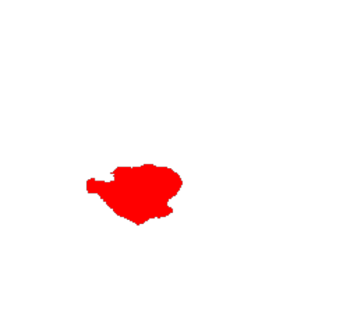
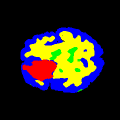
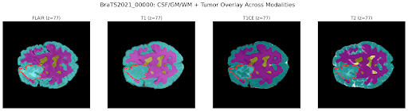
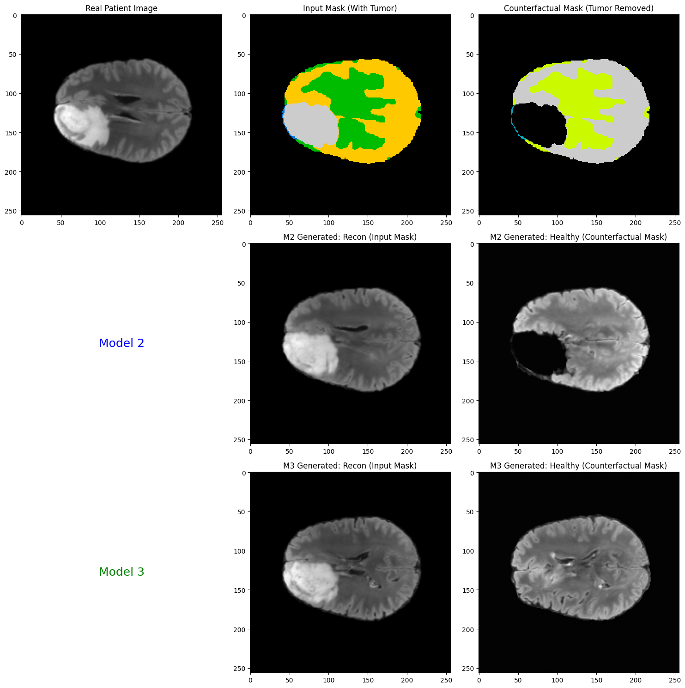
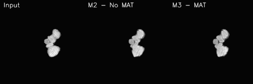

# Pathology-Controllable Brain MRI Synthesis with Segmentation-Guided Diffusion Models

## Project Overview

This project implements a segmentation-guided diffusion model for controllable brain MRI synthesis using the BraTS 2021 dataset. The goal is to generate realistic brain MRI images with precise control over pathological features (e.g., tumor size, location) through segmentation mask conditioning and Mask-Ablated Training (MAT).

### Key Contributions
- **Pathology-Level Control**: Explicit spatial guidance via segmentation masks
- **Counterfactual Generation**: Generate "what-if" healthy brain MRIs by removing/modifying tumors

---

## Project Structure

| File Name | Purpose | Description |
|-----------|---------|-------------|
| `Seg_guided_diffusion_preprocessing.ipynb` | Preprocessing Pipeline | Notebook to generate segmentation masks using ants on the brain and convert the generated 3D volumes into 2D slices|
| `Segmentation_U_Net_training.ipynb` | Segmentation Model Training | Trains the evaluation U-Net (Model 4) for predicting segmentation masks from generated images. Used for computing Dice scores during validation. |
| `MSML612_Project_Evaluation.ipynb` | Inference and evaluation model 1, 2 and 3 | Evaluation of models using different metrics such as FID, KID, SSIM, etc. The notebook also inferences the output|
| `DL_project_training_pipeline_no_MAT.ipynb` | Training Script for model 2 (Seg-Guided diffusion)| Contains training loop for model 2 |
| `DL_project_training_piepline-2.ipynb` | Training Script for model 3 (Seg-Guided diffusion + MAT (full model))| contains training loop for model 3 |
---

## Model Architecture

The project implements **four models** that work together:

| Model ID | Name | Purpose | Input | Output |
|----------|------|---------|-------|--------|
| **M1** | Unconditional Diffusion | Baseline for realism | Noisy image (x_t), timestep (t) | Predicted noise (ε̂) |
| **M2** | Seg-Guided Diffusion (no MAT) | Baseline for control | [Noisy image, Segmentation mask] | Predicted noise (ε̂) |
| **M3** | Seg-Guided + MAT | **Novel model** - Counterfactual generation | [Noisy image, Ablated mask] | Predicted noise (ε̂) |
| **M4** | Segmentation U-Net | Evaluation helper | Generated MRI image | Predicted segmentation mask |

### Mask-Ablated Training (MAT)
During training, tumor labels are randomly removed from segmentation masks with probability `p_ablate`. This teaches the model to:
- Reconstruct tumor regions when mask information is present
- Generate healthy tissue when tumor labels are ablated
- Enable controllable counterfactual generation at inference

---

## Dataset: BraTS 2021

**RSNA-ASNR-MICCAI BraTS 2021 Challenge**
- **Size**: 2,040 pre-operative MRI studies
- **Modalities**: T1, T1Gd, T2, T2-FLAIR
- **Annotations**: Expert-labeled segmentation masks (enhancing tumor, edema, necrotic core)
- **Sources**: 
  - [Kaggle](https://www.kaggle.com/datasets/dschettler8845/brats-2021-task1)

### Preprocessing Pipeline
1. Convert 3D NIfTI volumes to 2D slices (128×128)
2. Normalize intensity values
3. Extract FLAIR modality + segmentation masks
4. 100 patients data used. Split: 80% train, 10% validation, 10% test

---

## Setup Instructions

### Prerequisites
```bash
Python 3.8+
PyTorch 2.0+
CUDA-compatible GPU (recommended)
```

### Installation
```bash
# Clone repository
git clone git@github.com:PranavShashidhara/Seg_diffusion.git
cd Seg_diffusion

# Create virtual environment
python -m venv seg_venv
source seg_venv/bin/activate  # On Windows: seg_venv\Scripts\activate

# Install dependencies
pip install torch torchvision diffusers accelerate
pip install numpy pandas matplotlib scikit-image nibabel
pip install jupyter notebook
```


---

## Evaluation Metrics

| Metric | M1 (Baseline) | M2 (Full Model) | M3 (Ablation with MAT) | Purpose | Implementation/Validation Method |
| :--- | :--- | :--- | :--- | :--- | :--- |
| **FID** (Fréchet Inception Distance) | 219.403 | 75.9503 | **58.1257** | **Realism/Distribution Quality:** Measures how similar the generated image distribution is to the real data distribution. **Lower is better.** | Calculated by comparing the feature embeddings of the generated image set against the real BraTS T1Gd dataset. M3's result validates the success of MAT in improving general realism. |
| **KID** (Kernel Inception Distance) | 0.7911 | 0.2129 | **0.1327** | **Realism/Distribution Quality:** A robust distance measure, similar to FID, comparing image distributions. **Lower is better.** | Provides a complementary measure to FID for assessing the perceptual quality and realism of the synthetic MRIs. |
| **SSIM** (Structural Similarity Index Measure) | 0.2604 | **0.723** | 0.7115 | **Anatomy Preservation:** Measures the preservation of non-pathological, patient-specific anatomical structures. **Higher is better.** | Computed **only outside the lesion** area to ensure the surrounding healthy brain tissue remains consistent when the pathology is altered. |
| **GenDice** (Generated Dice Score) | 0.1541 | **0.7136** | 0.6881 | **Pathology Adherence/Fidelity:** Measures how accurately the generated tumor matches the input segmentation mask's shape and size. **Higher is better.** | A separate small U-Net segments the tumor in the *generated* image; the Dice score is then computed between this segmentation and the *input control mask*. |
| **TumorResidual** | **0.0253** | 1.6248 | 0.5455 | **Counterfactual Quality:** Tracks residual differences within the tumor region after an alteration (e.g., removal). For pathology removal, **Lower is better.** | Measures the effectiveness of pathology removal. M3's lower value (compared to M2) confirms **Mask-Ablated Training (MAT)** successfully teaches the model to "inpaint" healthy tissue. |
| **DiffMapIoU** (Difference Map IoU) | 0.0228 | 0.1524 | **0.157** | **Locality of Change:** Confirms that edits (differences between original and generated images) are confined to the intended pathological region. **Higher is better.** | Threshold the absolute difference map (Original - Generated) and compute the IoU with the ground-truth tumor mask to verify the edit is **localized**. |

### Running Evaluation
- Evaluation of the model can be done using the script `MSML612_Project_Evaluation.ipynb` to run the evaluation on model 1, 2, 3 and using the model 4 as well.

---

## Experimental Workflow

```
┌─────────────────────────────────────┐
│   BraTS 2021 Dataset                │
│   (MRI + Segmentation Masks)        │
└──────────────┬──────────────────────┘
               │
               ▼
┌──────────────────────────────────────┐
│   Preprocessing                      │
│   • Load NIfTI files (3D → 2D)       │
│   • Apply segmentation               │
│   • Convert 3D Volumes to 2D         │
│   • Remove slides which are empty    │
│   •  Split into Train/val/test split │
└──────────────┬───────────────────────┘
               │
               ▼
┌──────────────────────────────────────┐
│   Training Phase                     │
│   • M1: Unconditional Diffusion      │
│   • M2: Seg-Guided (no MAT)          │
│   • M3: Seg-Guided + MAT ⭐          |
|   • M4: Segmentation U-Net           │
└──────────────┬───────────────────────┘
               │
               ▼
┌──────────────────────────────────────┐
│   Inference & Counterfactuals        │
│   • Original MRI                     │
│   • Modified mask                    │
│   • Generated healthy MRI            │
└──────────────┬───────────────────────┘
               │
               ▼
┌──────────────────────────────────────────────┐
│   Evaluation                                 │ 
│   • M4: Segment generated images             │
│   • Compute Dice, SSIM, IoU, KID, FID        │
│   • Visualize difference maps                │
└──────────────────────────────────────────────┘
```

---
# Results
| Image | Description |
| :---: | :--- |
|  | **Original T1Gd Scan:** A baseline pathological image from the dataset. |
|  | **Pathological Focus:** An image highlighting the tumor region used for analysis. |  | **Final Output Mask:** Final Output mask after segmentation. |
|  | **Anatomical Segmentation Mask:** The conditioning map showing brain and tumor regions. |

### Segmentation output
- Overlay of mask on each of the different modalities (T1, T2, T1CE and Flair) is as shown below



The models M1, M2, M3 and M4 are trained on the dataset, following which the outputs are as shown below: 



### Controllable Synthesis Demonstration

The following GIF showcases the model's core capability: generating a counterfactual "what-if" image, such as removing the tumor based on an ablated segmentation mask.



## References

**Original Paper:**
- Anatomically-Controllable Medical Image Generation with Segmentation-Guided Diffusion Models
  GitHub: [mazurowski-lab/segmentation-guided-diffusion](https://github.com/mazurowski-lab/segmentation-guided-diffusion)

**Dataset:**
- Baid, U., et al. (2021). The RSNA-ASNR-MICCAI BraTS 2021 Benchmark on Brain Tumor Segmentation and Radiogenomic Classification. *arXiv preprint*.

---

## License

This project is for academic research purposes only. Please refer to `CITATION.md` for proper attribution.

---

## Acknowledgments

- BraTS 2021 Challenge organizers for providing the dataset
- Hugging Face team for the Diffusers library
- Original SegGuidedDiff authors for the foundational methodology